# Kubernetes 集群网络深度解析

> 场景：PodA（node1）通过 Service IP 访问 PodB（node2）的完整数据路径

---

## 第0节：场景定义与模式说明

### 地址规划

本文档以下列地址规划贯穿全文：

| 角色 | IP | 说明 |
|:---|:---|:---|
| node1 | 192.168.1.10 | PodA 所在节点 |
| node2 | 192.168.1.11 | PodB 所在节点 |
| PodA | 10.244.1.2 | 发起请求方 |
| Service ClusterIP | 10.96.0.100:80 | 虚拟 IP，无实体网卡 |
| PodB | 10.244.2.3 | 接收请求方（3个 endpoint 之一） |
| PodC | 10.244.2.4 | endpoint 备选 |
| PodD | 10.244.1.5 | endpoint 备选（同 node1） |

### 本文使用模式说明

#### kube-proxy 模式对比

| 模式 | 性能 | 适用场景 | 特点 |
|:---|:---|:---|:---|
| **IPVS** | ⭐⭐⭐ 极高 | 生产环境，>1000 Services | 内核哈希表 O(1) 查找，支持多种调度算法 |
| iptables | ⭐⭐ 中等 | 中小集群，经典方案 | 规则线性匹配 O(n)，随 Service 数量增长性能下降 |
| eBPF | ⭐⭐⭐ 极高 | 云原生/高级场景 | 绕过 netfilter，直接内核处理，需较新内核 |

#### Calico 网络模式对比

| 模式 | overlay | 底层网络要求 | 性能 | 适用场景 |
|:---|:---|:---|:---|:---|
| **BGP** | ❌ 无 | 需支持 BGP/静态路由 | 最佳 | on-prem 数据中心，生产推荐 |
| VXLAN | ✅ UDP 封装 | 仅需 L3 可达 | 有损耗(~50字节/包) | 公有云/受限网络环境 |

#### 主线声明

📌 **本文以 Calico BGP + kube-proxy IPVS 为主线展开**，在关键节点用「📌 变体提示框」引出 iptables 模式 / VXLAN 模式的差异，并链接到附录详解。


---

## 第1节：整体网络拓扑图

### 完整数据路径全景

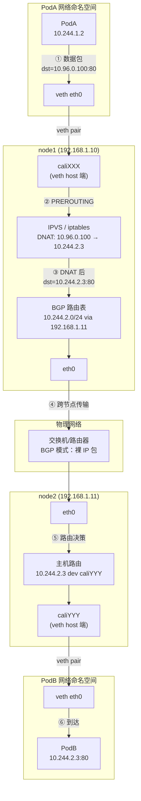

### 10步高层路径概览

1. **PodA 构造数据包**，dst = Service IP（10.96.0.100:80）
2. **穿越 veth** 到 node1 host network namespace
3. **IPVS 执行 DNAT**，选中 PodB（10.244.2.3:80）
4. **Calico BGP 路由表**决定下一跳（192.168.1.11）
5. **数据包出 node1 eth0**
6. **物理网络传输**（BGP 模式：裸 IP 包，无封装）
7. **数据包入 node2 eth0**
8. **node2 路由到 caliYYY**
9. **穿越 veth** 到达 PodB
10. **PodB 收到数据包**，应用层处理

> 📌 **变体提示（VXLAN）**：步骤 6 中，VXLAN 模式会将数据包封装为 UDP/4789 包，外层 src/dst 为 node IP，内层保持 Pod IP。详见 [附录C：VXLAN 详解](#appendix-vxlan)

---

## 第2节：node1 内部——请求路径

### 2.1 PodA 发包

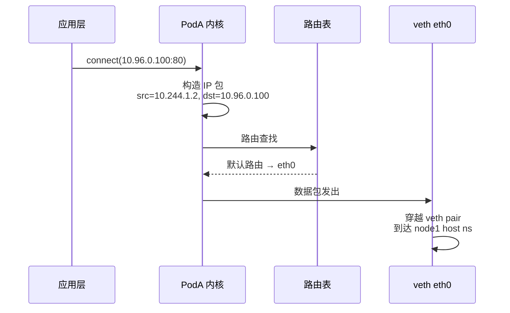

**步骤详解：**

1. **应用层调用** `connect(10.96.0.100:80)`，内核构造 IP 数据包
2. **PodA 内部路由表查找**：仅有默认路由 `0.0.0.0/0 via eth0`
3. **数据包通过 veth pair** 从 PodA network namespace 穿出，到达 node1 host ns 的 `caliXXX` 网卡
4. **触发 node1 内核 netfilter hook**（PREROUTING 链）

**命令示例：**
```bash
# 在 PodA 内查看路由表
kubectl exec -it pod-a -- ip route show
# default via 169.254.1.1 dev eth0 
# 169.254.1.1 dev eth0 scope link
```

---

### 2.2 IPVS 负载均衡（Service IP → Pod IP 转换）

这是整个流程最核心的一步。

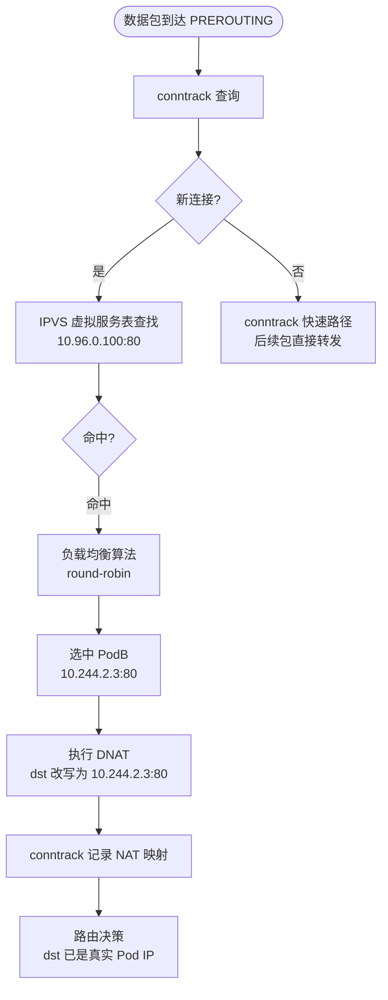

**步骤详解：**

1. **kube-proxy 启动时**通过 `ipvsadm` 创建虚拟服务：
   - VS（Virtual Service）：`10.96.0.100:80`
   - RS（Real Server）：`10.244.2.3:80`, `10.244.2.4:80`, `10.244.1.5:80`

2. **数据包命中 IPVS**，内核 netfilter IPVS hook 处理

3. **按 round-robin 算法**选中 `10.244.2.3`

4. **DNAT 改写目标地址**，conntrack 记录映射关系：
   ```
   (src=10.244.1.2, dst=10.96.0.100:80) → (dst=10.244.2.3:80)
   ```

5. **后续该连接所有包**直接走 conntrack 快速路径，不再查询 IPVS 表

**命令示例：**
```bash
# 查看 IPVS 虚拟服务和真实服务器
ipvsadm -Ln
# IP Virtual Server version 1.2.1 (size=4096)
# Prot LocalAddress:Port Scheduler Flags
#   -> RemoteAddress:Port           Forward Weight ActiveConn InActConn
# TCP  10.96.0.100:80 rr
#   -> 10.244.2.3:80                Masq    1      0          0         ← PodB
#   -> 10.244.2.4:80                Masq    1      0          0         ← PodC  
#   -> 10.244.1.5:80                Masq    1      0          0         ← PodD

# 查看连接跟踪表
conntrack -L | grep 10.96.0.100
```

> ▎ 📌 **[变体] iptables 模式**
> ▎ kube-proxy 可改用 iptables 实现相同功能：
> ▎ `PREROUTING → KUBE-SERVICES → KUBE-SVC-xxx → KUBE-SEP-xxx → DNAT`
> ▎ 规则更直观，但随 Service 数量增长性能下降（O(n) 线性匹配）。
> ▎ → [附录B：iptables 详解](#appendix-iptables)

---

### 2.3 Calico BGP 路由决策

DNAT 后 dst=`10.244.2.3`，查 node1 路由表：

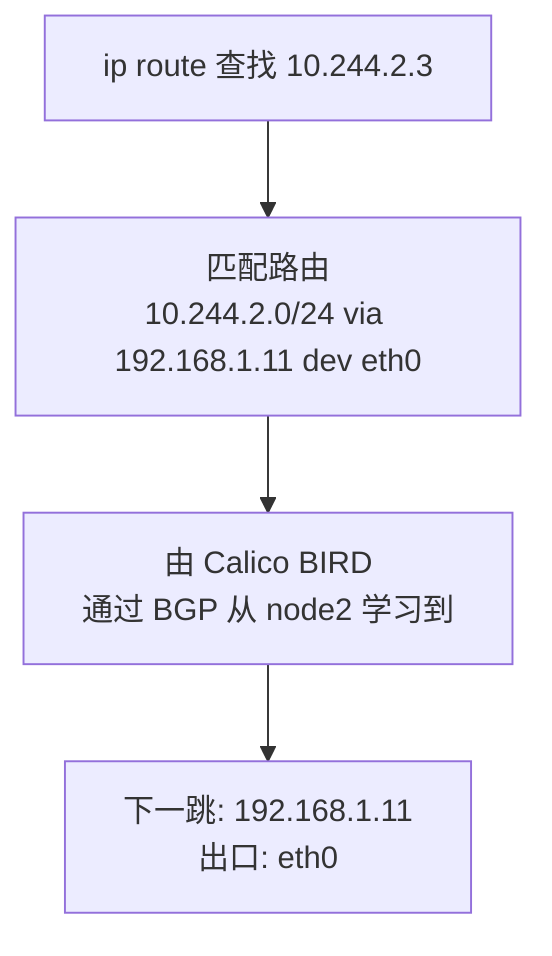

**步骤详解：**

1. **Calico 在每个 node 上运行 BIRD**（BGP 守护进程）

2. **node2 的 BIRD 向 node1 通告**：`10.244.2.0/24` 可达，下一跳 `192.168.1.11`

3. **node1 内核路由表写入该路由**

4. **数据包按此路由转发**

**命令示例：**
```bash
# node1 上查看 Calico 注入的路由
ip route show | grep 10.244.2
# 10.244.2.0/24 via 192.168.1.11 dev eth0 proto bird metric 32

# 查看 BGP 对等状态
calicoctl node status
# +---------------+-------------------+-------+----------+-------------+
# | PEER ADDRESS  |     PEER TYPE     | STATE |  SINCE   |    INFO     |
# +---------------+-------------------+-------+----------+-------------+
# | 192.168.1.11  | node-to-node mesh | up    | 10:00:00 | Established |

# 查看 BIRD 学到的路由
birdc show route
# 10.244.2.0/24  unicast [BGP 10:00:00] * (100) [AS64512i]
# 	via 192.168.1.11 on eth0
```

> ▎ 📌 **[变体] VXLAN 模式**
> ▎ 云环境中物理网络不支持 BGP 时，Calico 改用 VXLAN：
> ▎ 数据包在此处会被封装为 UDP/VXLAN 包，外层 dst 改为 node2 IP，
> ▎ 通过 `vxlan.calico` 虚拟网卡发出，性能有损耗。
> ▎ → [附录C：VXLAN 详解](#appendix-vxlan)

---

## 第3节：node1 → node2 跨节点传输

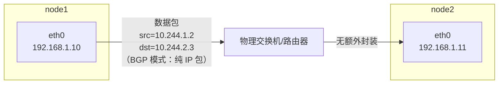

**步骤详解：**

1. **数据包离开 node1 eth0**：
   - 以太网帧：src MAC=node1, dst MAC=node2（ARP 解析 `192.168.1.11`）
   - IP 层：src=`10.244.1.2`（Pod IP 保留，无 SNAT），dst=`10.244.2.3`

2. **物理网络传输**（L2 或 L3 转发，取决于网络拓扑）

3. **数据包到达 node2 eth0**

**关键说明：** BGP 模式下 src IP 保留为 PodA 真实 IP（`10.244.1.2`），
PodB 看到的来源地址是真实的 Pod IP，这对某些应用（如需要获取客户端真实 IP 的审计日志）有意义。

**命令示例：**
```bash
# 在 node2 上抓包查看（Pod IP 直接可见）
tcpdump -i eth0 host 10.244.1.2
# 能看到 src=10.244.1.2, dst=10.244.2.3 的裸 IP 包
```

> ▎ 📌 **[变体] VXLAN 封装**
> ▎ VXLAN 模式下，此处是封装后的 UDP 包：
> ▎ - 外层：src=`192.168.1.10`, dst=`192.168.1.11`, UDP:4789
> ▎ - 内层：src=`10.244.1.2`, dst=`10.244.2.3`
> ▎ → [附录C：VXLAN 详解](#appendix-vxlan)

---

## 第4节：node2 内部——请求到达 PodB

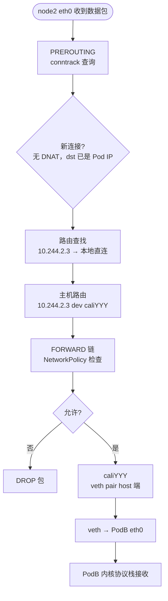

**步骤详解：**

1. **PREROUTING**：conntrack 查询，新连接，**不做 DNAT**（目标已是真实 Pod IP）

2. **路由查找**：Calico 为每个 Pod 在 host ns 写入 32 位主机路由：
   ```
   10.244.2.3 dev caliYYY scope link
   ```

3. **FORWARD 链**：
   - Calico Felix 插入的 NetworkPolicy 规则（如有）
   - 无 Policy 则直接放行

4. **数据包经 caliYYY → veth → PodB eth0**

5. **PodB 内核协议栈收到**：src=`10.244.1.2`, dst=`10.244.2.3`, dport=80

6. **转交给监听 80 端口的应用进程**

**命令示例：**
```bash
# node2 host ns 查看 Pod 主机路由
ip route show | grep 10.244.2.3
# 10.244.2.3 dev cali8f3d2c1a4b5 scope link

# 查看 Forward 链规则（Felix 写入的 NetworkPolicy）
iptables -nvL FORWARD
# Chain FORWARD (policy ACCEPT 0 packets, 0 bytes)
#  pkts bytes target     prot opt in     out     source               destination
#   100  8000 cali-FORWARD  all  --  *      *       0.0.0.0/0            0.0.0.0/0

# 查看某个 Pod 的专属访问控制链
iptables -t filter -L cali-tw-cali8f3d2c1a4b5 -n -v
```

---

## 第5节：响应路径（由浅入深）

### 5.0 响应路径概览（先看全局）

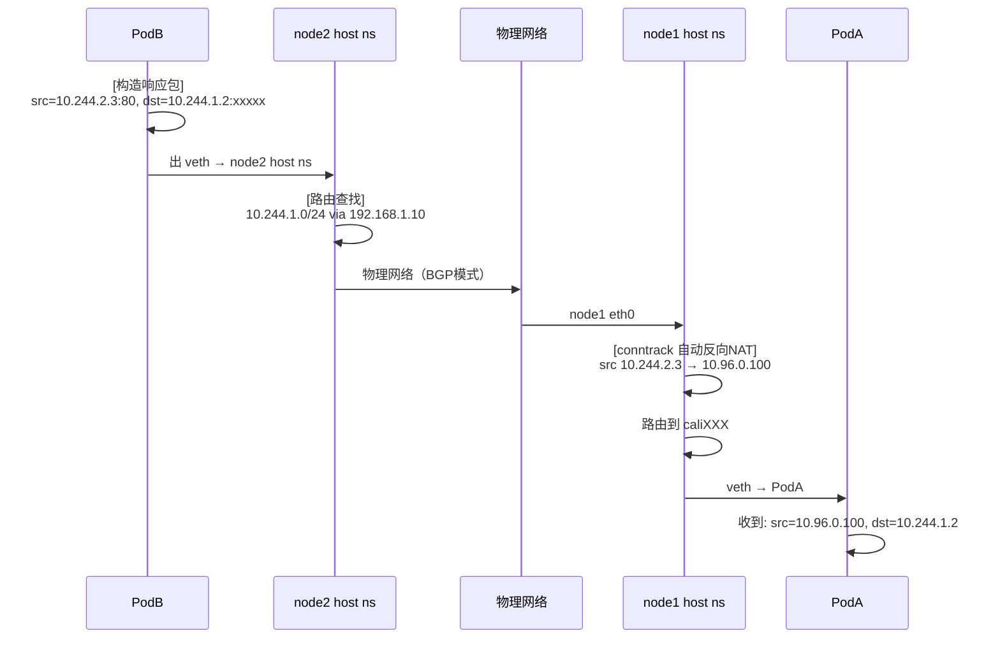

**关键点**：PodA 感知不到底层 NAT——它看到的响应来自 Service IP（`10.96.0.100`），
与它发出请求的目标一致，对应用层完全透明。

---

### 5.1 PodB 构造响应包

**步骤详解：**

1. **PodB 应用处理请求**，生成响应

2. **内核构造响应 IP 包**：
   - src=`10.244.2.3:80`, dst=`10.244.1.2:xxxxx`（原始源端口）

3. **PodB 路由查找**：`10.244.1.2` 不是本地地址，走默认路由 → eth0（PodB ns 内）→ veth → node2 host ns

---

### 5.2 node2 响应路由

**步骤详解：**

1. **数据包进入 node2 host ns**，经 FORWARD 链（NetworkPolicy 检查，出站规则）

2. **路由查找**：`10.244.1.x` → Calico BGP 路由：`via 192.168.1.10 dev eth0`

3. **数据包从 node2 eth0 发出**，src=`10.244.2.3`, dst=`10.244.1.2`

> ▎ 📌 **[变体] VXLAN**
> ▎ VXLAN 模式：此处同样封装为 UDP 包后发出

---

### 5.3 node1 接收响应 + conntrack 反向 NAT（关键！）

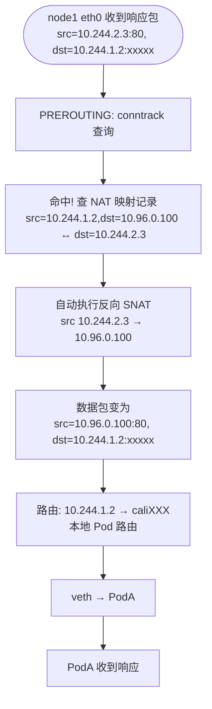

**步骤详解：**

1. **conntrack 是响应路径正确性的核心保障**

2. **node1 PREROUTING**：内核查连接跟踪表，找到请求时记录的 NAT 映射：
   ```
   原始方向: src=10.244.1.2, dst=10.96.0.100:80
   期望回包: src=10.244.2.3:80, dst=10.244.1.2  [DNAT]
   ```

3. **自动执行反向操作**：将响应包的 src IP 从 `10.244.2.3` 改写回 `10.96.0.100`

4. **这一步无需任何新的 IPVS/iptables 规则**，完全由 conntrack 状态机驱动

5. **改写后路由**：`10.244.1.2` 是本地 Pod，走主机路由 → caliXXX → veth

**命令示例：**
```bash
# 在 node1 上查看 DNAT 连接跟踪记录
conntrack -L --dst-nat | grep 10.96.0.100
# tcp      6 ESTABLISHED
#   src=10.244.1.2 dst=10.96.0.100 sport=50123 dport=80
#   src=10.244.2.3 dst=10.244.1.2  sport=80    dport=50123  [DNAT]
#   
# 第二行显示反向映射：响应时 src 自动从 10.244.2.3 换回 10.96.0.100
```

---

### 5.4 PodA 收到响应

**步骤详解：**

1. **数据包到达 PodA eth0**：src=`10.96.0.100:80`, dst=`10.244.1.2:xxxxx`

2. **PodA 内核**：匹配本地 socket，传递给应用

3. **PodA 感知**：
   ```
   我向 10.96.0.100 发了请求 ✓
   收到了来自 10.96.0.100 的响应 ✓
   ```

4. **整个 DNAT/SNAT 对 PodA 应用层完全透明**

---

---

## 附录

> 每个附录条目统一三段式结构：
> 1. **技术本身是什么**（独立于 k8s 的通用概念）
> 2. **独立使用示例**（脱离 k8s 的真实用法）
> 3. **在 k8s 中的角色**（k8s 如何借用它）

---

<a id="appendix-ipvs"></a>

### 附录A：IPVS / LVS 详解

#### ① 技术本身是什么

LVS（Linux Virtual Server）是 Linux 上的开源负载均衡项目，IPVS（IP Virtual Server）是其内核模块，工作在 L4（传输层），直接在内核协议栈处理转发，不经过用户空间，性能极高。

**核心概念：**

| 术语 | 含义 |
|:---|:---|
| VIP（Virtual IP） | 对外暴露的虚拟 IP，客户端连接这个地址 |
| VS（Virtual Service） | VIP:Port 组合，定义一个虚拟服务 |
| RS（Real Server） | 真实后端服务器，VS 的流量最终分发到这里 |
| 调度算法 | rr（轮询）/ lc（最小连接）/ sh（源地址哈希）/ wrr（加权轮询）等 |

**转发模式（三种）：**

| 模式 | 请求路径 | 响应路径 | 特点 |
|:---|:---|:---|:---|
| NAT 模式 | 经过 LVS | 经过 LVS | LVS 改写目标 IP，易配置 |
| DR 模式（直接路由） | 经过 LVS | 直接返回客户端 | 性能最高，RS 需特殊配置 |
| TUN 模式（IP 隧道） | 经过 LVS 隧道 | 直接返回客户端 | 跨网段，RS 通过隧道接收请求 |

#### ② 独立使用示例（NAT 模式：一台 LVS 机器负载均衡三台后端）

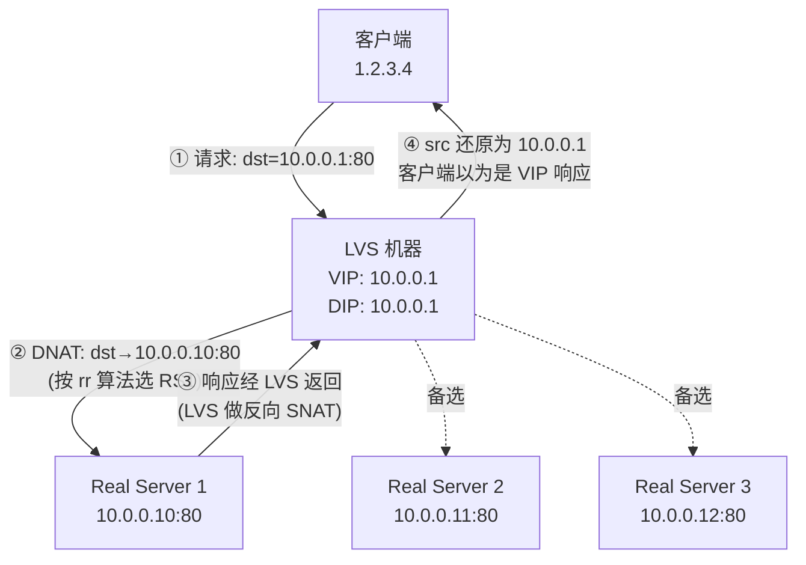

**步骤说明：**

1. 客户端向 VIP（`10.0.0.1:80`）发起请求
2. LVS 内核 IPVS 模块按调度算法（rr 轮询）选中 RS1（`10.0.0.10`）
3. DNAT 改写目标地址：dst=`10.0.0.1:80` → dst=`10.0.0.10:80`，conntrack 记录映射
4. 请求转发至 RS1，RS1 看到请求来自客户端（NAT 模式 RS 不需要特殊配置）
5. RS1 响应返回 LVS；LVS conntrack 匹配，自动反向 SNAT，src 从 `10.0.0.10` 还原为 `10.0.0.1`
6. 客户端收到响应，感知为 VIP 响应，全程透明

**命令：**
```bash
# 安装 ipvsadm 工具
apt install ipvsadm

# 创建虚拟服务（VIP:Port，轮询算法）
ipvsadm -A -t 10.0.0.1:80 -s rr

# 添加三台真实服务器（-m = masquerade = NAT 模式）
ipvsadm -a -t 10.0.0.1:80 -r 10.0.0.10:80 -m
ipvsadm -a -t 10.0.0.1:80 -r 10.0.0.11:80 -m
ipvsadm -a -t 10.0.0.1:80 -r 10.0.0.12:80 -m

# 查看当前配置
ipvsadm -Ln
# 输出：
# TCP  10.0.0.1:80 rr
#   -> 10.0.0.10:80    Masq  1    0    0
#   -> 10.0.0.11:80    Masq  1    0    0
#   -> 10.0.0.12:80    Masq  1    0    0

# 查看实时连接统计
ipvsadm -Ln --stats
```

#### ③ 在 k8s 中的角色

kube-proxy 在 IPVS 模式下，将每个 Service 的 `ClusterIP:Port` 转化为一个 IPVS VS，将其背后的所有 Endpoint（Pod IP:Port）注册为 RS：

```bash
# 查看 k8s 创建的 IPVS 虚拟服务
ipvsadm -Ln
# 会看到类似：
# TCP  10.96.0.100:80 rr
#   -> 10.244.2.3:80    Masq  1    0    0   ← PodB
#   -> 10.244.2.4:80    Masq  1    0    0   ← PodC
#   -> 10.244.1.5:80    Masq  1    0    0   ← PodD

# 查看 kube-proxy 当前模式
kubectl get configmap kube-proxy -n kube-system -o yaml | grep mode
# mode: "ipvs"
```

**相比 iptables 模式的优势**：哈希查找 O(1)，不随 Service 数量线性增长，支持更多负载均衡算法，生产环境 >1000 Services 时强烈推荐。

---

<a id="appendix-iptables"></a>

### 附录B：kube-proxy iptables 模式详解

#### ① 技术本身是什么

iptables 是 Linux 内核 netfilter 框架的用户空间管理工具，通过规则链（chain）和表（table）对数据包进行过滤、改写、转发。

**核心概念：**

| 概念 | 说明 |
|:---|:---|
| 表（table） | filter（过滤）/ nat（地址转换）/ mangle（改包）/ raw |
| 链（chain） | 数据包经过内核的固定钩子点：PREROUTING → INPUT/FORWARD → OUTPUT → POSTROUTING |
| 规则（rule） | 匹配条件 → 动作（ACCEPT/DROP/DNAT/SNAT/JUMP） |
| DNAT | 修改目标地址，将请求重定向到另一个 IP:Port |
| statistic 模块 | 按概率分流，用于实现简单的随机负载均衡 |

#### ② 独立使用示例（端口转发：本机 8080 → 后端 192.168.1.100:80）

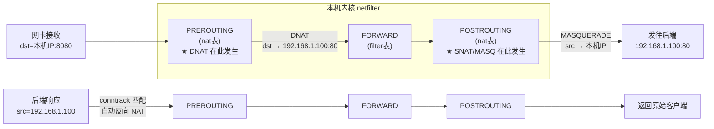

**步骤说明：**

1. 客户端请求到达本机，dst 端口为 8080
2. PREROUTING 阶段：iptables DNAT 规则命中，目标地址改写为 `192.168.1.100:80`
3. conntrack 记录这条 NAT 映射
4. FORWARD 链放行（需开启 `ip_forward`）
5. POSTROUTING 阶段：MASQUERADE 将源地址改为本机 IP，使后端响应能正确返回
6. 后端响应时：conntrack 自动识别，反向还原地址，返回给原始客户端

**命令：**
```bash
# 开启 IP 转发（必须）
sysctl -w net.ipv4.ip_forward=1

# DNAT：进来的 8080 流量转到后端
iptables -t nat -A PREROUTING -p tcp --dport 8080 -j DNAT --to-destination 192.168.1.100:80

# MASQUERADE：让后端看到的 src IP 是本机 IP（否则响应包路由回不来）
iptables -t nat -A POSTROUTING -d 192.168.1.100 -j MASQUERADE

# 查看 nat 表规则（含命中计数）
iptables -t nat -L -n -v --line-numbers
```

#### ③ 在 k8s 中的角色

kube-proxy 在 iptables 模式下，将每个 Service 转化为 nat 表中的一组自定义链：

```
PREROUTING → KUBE-SERVICES
               └─ KUBE-SVC-<hash>（每个 Service）
                   ├─ KUBE-SEP-AAA（33% 概率）→ DNAT → 10.244.2.3:80
                   ├─ KUBE-SEP-BBB（50% 概率）→ DNAT → 10.244.2.4:80
                   └─ KUBE-SEP-CCC（100% 兜底）→ DNAT → 10.244.1.5:80
```

**实际规则**（iptables-save 输出）：
```bash
-A KUBE-SERVICES -d 10.96.0.100/32 -p tcp --dport 80 -j KUBE-SVC-ABCD1234
-A KUBE-SVC-ABCD1234 -m statistic --mode random --probability 0.33 -j KUBE-SEP-AAA
-A KUBE-SVC-ABCD1234 -m statistic --mode random --probability 0.50 -j KUBE-SEP-BBB
-A KUBE-SVC-ABCD1234 -j KUBE-SEP-CCC
-A KUBE-SEP-AAA -p tcp -j DNAT --to-destination 10.244.2.3:80

# 查看 k8s 写入的 nat 链
iptables -t nat -L KUBE-SERVICES -n --line-numbers
iptables-save | grep KUBE-SVC
```

**性能限制**：1000 Service × 3 Endpoint ≈ 6000 条规则，每包线性遍历，>1000 Service 时应切换到 IPVS 模式。

---

<a id="appendix-vxlan"></a>

### 附录C：VXLAN 与 Calico VXLAN 模式详解

#### ① 技术本身是什么

VXLAN（Virtual Extensible LAN，RFC 7348）是一种 overlay 网络技术，将原始以太网帧封装进 UDP 包（目的端口 4789）传输，从而在 L3 网络上构建出虚拟的 L2 网络。

**封装格式**（由外到内）：
```
[ 物理以太网帧 ]
  [ 外层 IP（node1 → node2）]
    [ UDP dport=4789 ]
      [ VXLAN Header（含 24-bit VNI 网络标识符）]
        [ 内层以太网帧 ]
          [ 内层 IP（PodA → PodB）]
            [ 原始 payload ]
```

**核心组件 VTEP**（VXLAN Tunnel Endpoint）：负责封装和解封装的虚拟网卡。

#### ② 独立使用示例（两台机器手动建立 VXLAN 隧道）

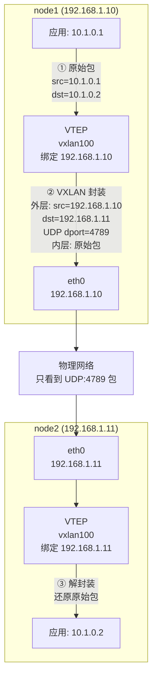

**步骤说明：**

1. node1 应用发出目标为 `10.1.0.2` 的包，本地路由命中 `vxlan100` 网卡
2. VTEP 查 FDB 表：`10.1.0.2` 对应的外层目标是 `192.168.1.11`
3. VTEP 封装：原始包加上 VXLAN header（VNI）+ UDP（dport=4789）+ 外层 IP（`192.168.1.11`）
4. 物理网络只看到 node1→node2 的普通 UDP 包，无需理解 overlay 网段
5. node2 的 `vxlan100` 收到后解封装，还原内层包，交给 `10.1.0.2`

**命令：**
```bash
# === 在 node1 上 ===
# 创建 VXLAN 接口（VNI=100，本端 IP 绑定 eth0）
ip link add vxlan100 type vxlan id 100 dstport 4789 local 192.168.1.10 dev eth0
ip addr add 10.1.0.1/24 dev vxlan100
ip link set vxlan100 up

# 填写 FDB：overlay IP 10.1.0.2 在 node2（192.168.1.11）
bridge fdb append 00:00:00:00:00:00 dev vxlan100 dst 192.168.1.11

# === 在 node2 上（对称配置）===
ip link add vxlan100 type vxlan id 100 dstport 4789 local 192.168.1.11 dev eth0
ip addr add 10.1.0.2/24 dev vxlan100
ip link set vxlan100 up
bridge fdb append 00:00:00:00:00:00 dev vxlan100 dst 192.168.1.10

# 验证：node1 ping node2（即使 10.1.x.x 在物理网络不存在路由）
ping 10.1.0.2

# 查看 VXLAN 设备详情
ip -d link show vxlan100

# 查看 FDB
bridge fdb show dev vxlan100
```

#### ③ 在 Calico 中的角色

当物理网络不支持 BGP（如公有云 VPC 禁止 BGP 协议），Calico 切换到 VXLAN 模式：

1. 每个 node 创建 `vxlan.calico` 虚拟 VTEP 网卡
2. Calico 将 Pod CIDR 路由改为走 `vxlan.calico`：`10.244.2.0/24 dev vxlan.calico`
3. 内核自动封装：内层包（PodA→PodB）被包进外层 UDP 包（node1→node2）
4. node2 的 `vxlan.calico` 接收并解封，内层包递交本地路由

```bash
# 查看 Calico VXLAN 虚拟网卡
ip -d link show vxlan.calico

# 查看 FDB（Calico 自动维护：哪个 Pod CIDR 在哪个 node）
bridge fdb show dev vxlan.calico
# 输出示例：
# 66:53:...（node2 的 VTEP MAC） dst 192.168.1.11 self permanent

# 查看路由（VXLAN 模式：走 vxlan.calico 而不是 eth0）
ip route show | grep vxlan
# 10.244.2.0/24 dev vxlan.calico scope link
```

**BGP vs VXLAN 对比：**

| 对比项 | BGP 模式 | VXLAN 模式 |
|:---|:---|:---|
| overlay | ❌ 无，纯 IP 路由 | ✅ 是，UDP 封装 |
| 底层网络要求 | 需支持 BGP/静态路由 | 仅需 L3 可达 |
| 额外开销 | 无 | ~50 字节/包 |
| 云环境适用性 | 通常不可用 | ✅ |
| MTU 注意 | 标准 1500 | 需设 Pod MTU=1450 |

---

<a id="appendix-bgp"></a>

### 附录D：BGP 与 Calico BGP 模式详解

#### ① 技术本身是什么

BGP（Border Gateway Protocol，RFC 4271）是互联网的路由协议，用于在不同自治系统（AS，Autonomous System）之间传播路由信息。互联网骨干网上各大运营商之间用的就是 BGP。

**核心概念：**

| 术语 | 说明 |
|:---|:---|
| AS（自治系统） | 一组在统一管理下的 IP 网络，有唯一的 AS Number |
| BGP Speaker | 运行 BGP 的路由器，向邻居宣告「哪些 IP 段我能到达」 |
| BGP Peer（对等体） | 建立 BGP 会话的两个 Speaker，互相交换路由 |
| 路由通告 | A 告诉 B「192.168.0.0/16 经过我能到」，B 写入路由表 |

#### ② 独立使用示例（两台路由器互相通告子网）

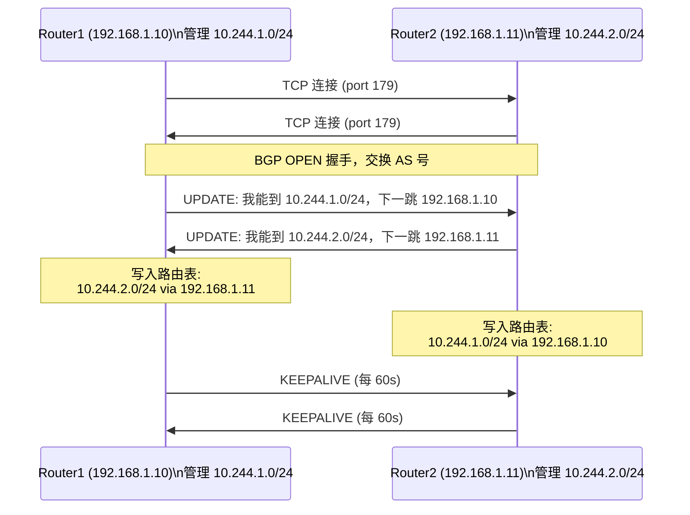

**步骤说明：**

1. 两台路由器各自运行 BIRD，配置好邻居地址和 AS 号
2. BGP 建立 TCP 连接（port 179），完成 OPEN 报文握手
3. 各自通过 UPDATE 报文宣告自己管理的子网（NLRI）及下一跳
4. 对端收到 UPDATE 后，将路由写入 BIRD 路由表，再同步到内核路由表
5. 此后每隔 60s 发 KEEPALIVE 保持会话，路由失效时发 WITHDRAW 撤销

**命令：**
```bash
# 安装 BIRD
apt install bird2

# /etc/bird/bird.conf（Router1 配置示例）
router id 192.168.1.10;

protocol bgp peer_r2 {
    neighbor 192.168.1.11 as 64512;
    local as 64512;
    ipv4 { export all; import all; };
}

protocol static {
    ipv4;
    route 10.244.1.0/24 via "eth0";  # 宣告本机管理的子网
}

protocol kernel {
    ipv4 { export all; };  # 将 BIRD 路由表同步到内核
}

# 启动并验证
systemctl start bird
birdc show protocols        # 查看 BGP 会话状态（Established=成功）
birdc show route            # 查看学到的路由
ip route show proto bird    # 验证路由已写入内核
```

#### ③ 在 Calico 中的角色

Calico 让每个 k8s node 都成为一个 BGP Speaker（使用 BIRD），互相通告各自管理的 Pod CIDR：

- node1 宣告：`10.244.1.0/24` 我能到
- node2 宣告：`10.244.2.0/24` 我能到

node1 收到 node2 的通告后，内核路由表自动写入：`10.244.2.0/24 via 192.168.1.11 dev eth0`

这样数据包到达 `10.244.2.3` 时，直接走物理网络发往 node2，无需任何封装，是性能最好的跨节点方案。

```bash
# 查看 Calico BGP 对等状态
calicoctl node status
# +---------------+-------------------+-------+----------+-------------+
# | PEER ADDRESS  |     PEER TYPE     | STATE |  SINCE   |    INFO     |
# +---------------+-------------------+-------+----------+-------------+
# | 192.168.1.11  | node-to-node mesh | up    | 10:00:00 | Established |

# 查看 BIRD 学到的路由
birdc show route
# 10.244.2.0/24  unicast [BGP 10:00:00] * (100) [AS64512i]
# 	via 192.168.1.11 on eth0

# 查看内核路由（BGP 注入的）
ip route show proto bird
# 10.244.2.0/24 via 192.168.1.11 dev eth0 proto bird metric 32
```

**集群规模扩展**：Full Mesh 模式下每对 node 建一个 BGP 连接（N×(N-1)/2），超过 50 个节点建议配置 Route Reflector 集中汇聚路由，避免连接数爆炸。

---

<a id="appendix-conntrack"></a>

### 附录E：conntrack（连接跟踪）详解

#### ① 技术本身是什么

conntrack 是 Linux 内核 netfilter 框架的连接跟踪子系统。它跟踪经过内核的每一条网络连接（TCP/UDP/ICMP），在内存中维护一张状态表（conntrack table），记录连接的完整状态，包括：

- **五元组**：src IP、dst IP、src port、dst port、protocol
- **连接状态**：NEW / ESTABLISHED / RELATED / INVALID
- **NAT 映射**：如果发生了 DNAT/SNAT，记录转换前后的地址对应关系

#### ② 独立使用示例（观察一条 TCP 连接的 conntrack 生命周期）

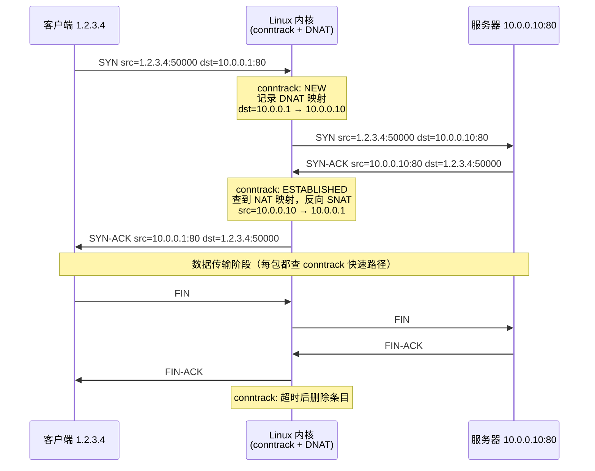

**步骤说明：**

1. 第一个 SYN 到达，conntrack 新建条目（状态 NEW），记录五元组和 DNAT 映射
2. 连接三次握手完成，状态变为 ESTABLISHED，此后走 conntrack 快速路径，不再走完整规则链
3. 响应包到来时，conntrack 查表找到反向映射，自动执行反向 NAT（SNAT），客户端感知透明
4. 连接关闭（FIN 或超时），conntrack 条目进入 TIME_WAIT，最终删除

**命令：**
```bash
# 安装 conntrack 工具
apt install conntrack

# 查看当前所有连接跟踪条目
conntrack -L
# 输出（每条两行：上=原始方向，下=期望回包方向）：
# tcp  6 ESTABLISHED
#   src=1.2.3.4   dst=10.0.0.1  sport=50000 dport=80
#   src=10.0.0.10 dst=1.2.3.4   sport=80    dport=50000  [DNAT]

# 实时监控连接新建/销毁（调试利器）
conntrack -E

# 只看含 DNAT 的条目
conntrack -L --dst-nat

# 高并发排查：查连接数 vs 上限
cat /proc/sys/net/netfilter/nf_conntrack_count   # 当前使用量
cat /proc/sys/net/netfilter/nf_conntrack_max     # 上限（默认 65536）

# 扩容（临时生效）
sysctl -w net.netfilter.nf_conntrack_max=524288
```

#### ③ 在 k8s 中的角色

conntrack 是 k8s Service 网络能够正常工作的隐藏基石，承担两个关键职责：

**职责1：记录 DNAT 映射（请求时）**

PodA 向 Service IP（`10.96.0.100`）发起连接，IPVS/iptables 执行 DNAT 将目标改写为 PodB IP（`10.244.2.3`）。conntrack 记录这个映射：
```
src=10.244.1.2  dst=10.96.0.100:80  →  [DNAT]  dst=10.244.2.3:80
```

**职责2：自动还原响应包的 src（响应时）**

PodB 响应时，src IP 是 `10.244.2.3`（真实 Pod IP），但 PodA 期望收到的是来自 `10.96.0.100` 的响应。conntrack 查表，自动执行反向 NAT：将响应包的 src 从 `10.244.2.3` 改回 `10.96.0.100`，PodA 感知不到底层任何 NAT，应用层完全透明。

```bash
# 在 node1 上查看 k8s 的 DNAT 连接记录
conntrack -L --dst-nat | grep 10.96.0.100
# tcp 6 ESTABLISHED
#   src=10.244.1.2 dst=10.96.0.100 sport=50123 dport=80
#   src=10.244.2.3 dst=10.244.1.2  sport=80    dport=50123  [DNAT]
```

---


<a id="appendix-veth"></a>

### 附录F：veth pair（虚拟以太网对）详解

#### ① 技术本身是什么

veth pair（Virtual Ethernet Pair）是 Linux 内核提供的虚拟网络设备，总是成对出现，两端通过内核内存直接连通：数据从一端写入，立即从另一端读出，相当于一根虚拟网线。

与物理网卡不同，veth 不需要物理介质，完全在内核内存中工作，延迟极低。它最常见的用途是连接两个不同的网络命名空间（network namespace）。

Linux network namespace 隔离了整套网络栈（网卡、路由表、iptables、socket），不同 ns 之间默认完全隔离，veth pair 是打通它们的标准手段。

#### ② 独立使用示例（手动创建两个 ns，用 veth pair 连通）

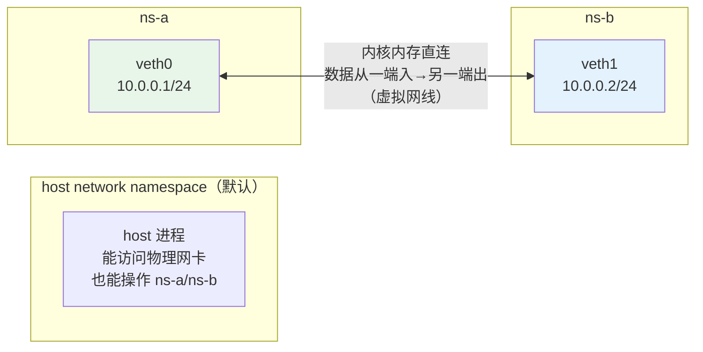

**步骤说明：**

1. 创建两个独立的网络命名空间（ns-a，ns-b），各自拥有完全隔离的网络栈
2. 创建一对 veth（veth0 + veth1），此时两端都在 host ns
3. 将 veth0 移入 ns-a，veth1 移入 ns-b（移入后 host ns 就看不到它了）
4. 在各自 ns 内配置 IP 地址并 up 网卡
5. 此时 ns-a 的 `10.0.0.1` 可以直接 ping 通 ns-b 的 `10.0.0.2`，流量在内核内存中传递，不经过物理网卡

**命令：**
```bash
# 创建两个网络命名空间
ip netns add ns-a
ip netns add ns-b

# 创建 veth pair（两端都暂在 host ns）
ip link add veth0 type veth peer name veth1

# 分别移入各自 ns
ip link set veth0 netns ns-a
ip link set veth1 netns ns-b

# 在各 ns 内配置 IP 并启动
ip netns exec ns-a ip addr add 10.0.0.1/24 dev veth0
ip netns exec ns-a ip link set veth0 up
ip netns exec ns-b ip addr add 10.0.0.2/24 dev veth1
ip netns exec ns-b ip link set veth1 up

# 验证：ns-a ping ns-b（完全隔离的网络栈之间通信）
ip netns exec ns-a ping 10.0.0.2

# 查找 veth pair 对应关系（通过 ifindex）
ip netns exec ns-a ip link show veth0   # 记下 peer_ifindex 字段的数字
ip link show | grep "^<那个数字>:"      # 在 host 找到对端
```

#### ③ 在 k8s 中的角色

每当一个 Pod 被创建，CNI（Calico）会自动：

1. 为 Pod 创建专属网络命名空间
2. 创建一对 veth：一端（eth0）放入 Pod ns，一端（caliXXXXXXXX）留在 host ns
3. 配置 Pod 端 IP（如 `10.244.1.2/32`）和默认路由

这使得 Pod 有完全隔离的网络栈，同时通过 caliXXX 与 host 保持连通：

```bash
# 在 host 上查看所有 Pod 对应的 veth
ip link show type veth
# 示例：cali8f3d2c1a4b5  → Pod X 的连接

# 找出某个 Pod 对应的 host 端 veth
# 1. 进入 Pod 查看它的 eth0 对应的 ifindex
kubectl exec -it <pod-name> -- cat /sys/class/net/eth0/iflink
# 假设输出 17

# 2. 在 host 找 ifindex=17 的网卡
ip link show | grep "^17:"
# 17: cali8f3d2c1a4b5@...

# 进入 Pod 的网络命名空间（调试用）
# 找到 Pod 的进程 PID
PID=$(crictl inspect $(crictl ps | grep <pod> | awk '{print $1}') | python3 -c "import sys,json; print(json.load(sys.stdin)['info']['pid'])")
nsenter -t $PID -n ip addr show
nsenter -t $PID -n ip route show
```

---

<a id="appendix-felix"></a>

### 附录G：Felix（Calico 策略执行引擎）详解

#### ① 技术本身是什么

Felix 是 Calico 内部的一个守护进程，是 Calico 的数据平面执行引擎。它不是一个通用 Linux 工具，是 Calico 专有组件，作为 calico-node DaemonSet 的一部分运行在每个 node 上。

Felix 的职责是把抽象的网络策略（NetworkPolicy CRD）翻译成内核能执行的具体规则，并保持规则与集群状态始终同步。它支持多种数据平面：

| 数据平面 | 说明 |
|:---|:---|
| iptables 模式（默认） | 写 iptables 链 |
| eBPF 模式 | 直接写 eBPF 程序，绕过 iptables，性能更高 |
| nftables 模式 | 新一代 Linux 防火墙框架 |

#### ② Felix 的核心工作流程

（Felix 是 Calico 专有组件，无法独立于 Calico 使用；此处展示它内部的工作逻辑）

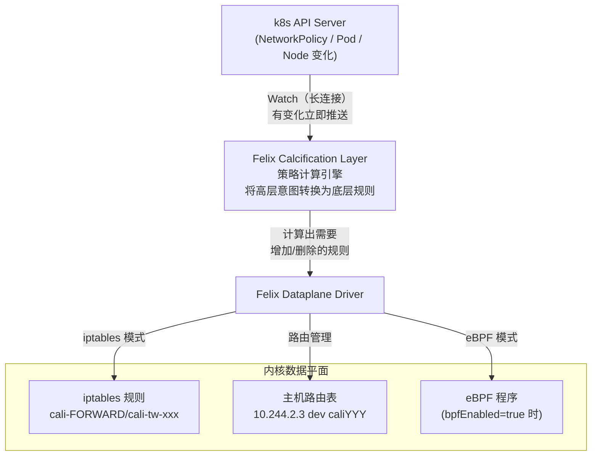

**步骤说明：**

1. Felix 启动后 Watch k8s API Server，监听 NetworkPolicy、Pod、Node 的增删改
2. 收到变化事件，Calcification 层计算出受影响的规则集（增量计算，不是全量重建）
3. Dataplane Driver 将规则变化同步到内核：写/删 iptables 链，更新路由表
4. 对于新建 Pod：Felix 创建 32 位主机路由（`10.244.2.3 dev caliYYY`），使 host 能路由到该 Pod
5. 对于 NetworkPolicy 变化：Felix 在对应 Pod 的 cali-tw-xxx 链中插入/删除规则

**命令：**
```bash
# 查看 Felix 配置
kubectl get felixconfiguration default -o yaml
# bpfEnabled: false         → 使用 iptables 模式
# iptablesBackend: Legacy   → iptables 后端

# 实时观察 Felix 在做什么
kubectl logs -n kube-system -l k8s-app=calico-node -c calico-node -f | grep -i felix

# 查看 Felix 写入的 iptables 链（cali- 前缀）
iptables -nvL | grep "^Chain cali"
# Chain cali-FORWARD
# Chain cali-INPUT
# Chain cali-tw-cali8f3d2c1a4b5  ← 某个 Pod 的专属访问控制链

# 查看 Felix 写入的 Pod 主机路由
ip route show | grep cali
# 10.244.2.3 dev caliYYY scope link  ← Felix 写的
```

#### ③ 在 k8s 中的角色

Felix 与 kube-proxy 分工明确，互不干扰：

| 组件 | 写规则的目的 | 典型规则内容 |
|:---|:---|:---|
| kube-proxy | Service 负载均衡（DNAT） | KUBE-SERVICES, KUBE-SVC-xxx |
| Felix | NetworkPolicy 访问控制 + Pod 路由 | cali-FORWARD, cali-tw-xxx |

**Felix 做的两件核心工作：**

**工作1：为每个 Pod 创建主机路由**
```bash
ip route show | grep cali
# 10.244.2.3 dev caliYYY scope link  ← Felix 写的，指向 PodB 的 veth
```

**工作2：将 NetworkPolicy 转化为 per-Pod iptables 规则**
```bash
# 查看某个 Pod 的入站规则链（Felix 自动生成）
iptables -t filter -L cali-tw-cali8f3d2c1a4b5 -n -v
# 如果有 NetworkPolicy 限制，Felix 会在这里插入 ACCEPT/DROP 规则
```

---

<a id="appendix-cidr"></a>

### 附录H：Pod CIDR / Service CIDR / Node IP 三个地址空间

#### ① 技术本身是什么

这三个地址空间都是 IP 地址，但来自完全不同的网络层次，服务于不同目的：

| 地址空间 | 来源 | 用途 |
|:---|:---|:---|
| Node IP | 物理机/虚拟机的真实 IP | 由数据中心网络分配，物理可路由 |
| Pod CIDR | k8s 给 Pod 分配 IP 的范围 | 每个 node 分到一个子段，只在集群内可路由 |
| Service CIDR | 给 Service 分配虚拟 IP 的范围 | 这些 IP 没有对应的任何网卡，是纯虚拟地址 |

**理解核心**：Service IP 是一个「幽灵 IP」——没有任何设备绑定它，数据包在到达路由查找之前已被 IPVS/iptables DNAT 改写成真实 Pod IP，所以它「工作」但「不存在」。

#### ② 三个地址空间的关系示意

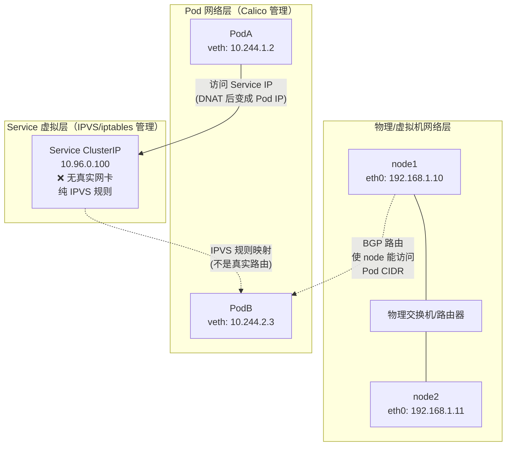

**步骤说明：**

1. **Node IP 层**：数据中心物理网络，节点间可直接通信（L2 或 L3）
2. **Pod CIDR 层**：Calico 通过 BGP/VXLAN 在节点间建立 overlay 或直连路由，让 Pod IP 在集群内可路由
3. **Service CIDR 层**：纯虚拟层，没有任何网卡绑定这些 IP；kube-proxy 在每个 node 写 IPVS 规则，数据包碰到这些 IP 时在 PREROUTING 阶段就被 DNAT 改写成真实 Pod IP，进入正常路由流程

**命令：**
```bash
# 查看三个地址空间

# 1. Node IP（物理网卡）
ip addr show eth0
# inet 192.168.1.10/24 brd 192.168.1.255 scope global eth0

# 2. Pod CIDR（每个 node 分到的子段）
kubectl get nodes -o jsonpath='{range .items[*]}{.metadata.name}{"\t"}{.spec.podCIDR}{"\n"}{end}'
# node1   10.244.1.0/24
# node2   10.244.2.0/24

# 3. Service CIDR（apiserver 启动参数）
kubectl cluster-info dump | grep service-cluster-ip-range
# --service-cluster-ip-range=10.96.0.0/12

# 证明 Service IP 没有绑定任何网卡
ip addr | grep 10.96        # 找不到任何结果
# 但在 Pod 内访问 Service IP 是通的（IPVS 规则在起作用）
```

**三个空间的分配方式对比：**

| 地址空间 | 示例 | 分配者 | 实体网卡 | 可达范围 |
|:---|:---|:---|:---|:---|
| Node IP | 192.168.1.0/24 | 数据中心网络/DHCP | ✅ eth0 | 数据中心内 |
| Pod CIDR | 10.244.0.0/16 | kube-controller-manager | ✅ veth（Pod 内 eth0） | 集群内（BGP/VXLAN 路由） |
| Service CIDR | 10.96.0.0/12 | kube-apiserver | ❌ 无 | 集群内（IPVS/iptables 规则） |

#### ③ 在 k8s 中的角色

这三个地址空间必须互不重叠，否则路由会冲突。规划 k8s 集群时必须明确划分：

```bash
# 典型集群地址规划（kubeadm 初始化参数）
kubeadm init \
  --pod-network-cidr=10.244.0.0/16 \     # Pod CIDR（给 Calico 用）
  --service-cidr=10.96.0.0/12            # Service CIDR

# 检查规划是否冲突
# Pod CIDR:     10.244.0.0  - 10.244.255.255   (/16)
# Service CIDR: 10.96.0.0   - 10.111.255.255   (/12)
# Node IP:      192.168.1.0 - 192.168.1.255    (/24)
# → 三个范围完全不重叠 ✓
```

**常见错误**：Pod CIDR 与公司内部网络 IP 段重叠，导致集群内 Pod 无法访问公司内部服务。扩容规划时也要预留足够空间（/16 可容纳 256 个 /24 的 node 子网）。

---

## 快速参考：调试命令速查表

| 调试目标 | 命令 |
|:---|:---|
| 查看 Pod IP | `kubectl get pod -o wide` |
| 查看 Service 详情 | `kubectl get svc -o wide` |
| 查看 Endpoints | `kubectl get endpoints <svc>` |
| 查看 IPVS 规则 | `ipvsadm -Ln` |
| 查看 iptables 规则 | `iptables -t nat -L -n -v` |
| 查看 conntrack | `conntrack -L \| grep <ip>` |
| 查看路由表 | `ip route show` |
| 查看 BGP 状态 | `calicoctl node status` |
| 查看 BIRD 路由 | `birdc show route` |
| 进入 Pod 网络 ns | `nsenter -t <pid> -n <cmd>` |
| 查看 veth 对应关系 | `ip link show type veth` |
| 抓包跨节点流量 | `tcpdump -i eth0 host <pod-ip>` |
| 查看 Felix 日志 | `kubectl logs -n kube-system -l k8s-app=calico-node` |

---

> 文档版本：v1.0  
> 主线模式：Calico BGP + kube-proxy IPVS  
> 适用环境：on-prem 数据中心 / 私有云
